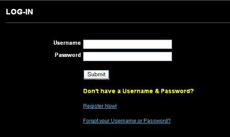
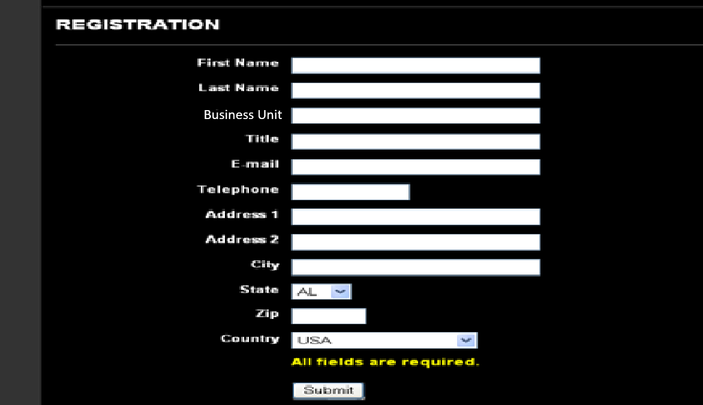
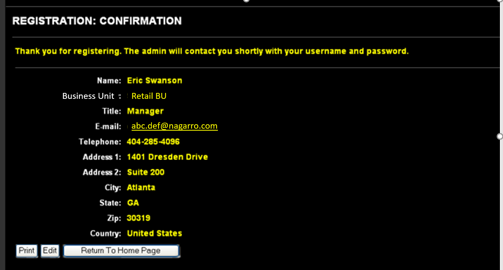
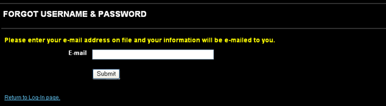
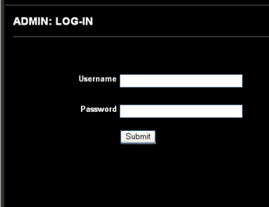

# TravelPortal

  Travel team wants to prepare a portal which can be used by the employees for raising requests for the tickets, hotel rooms etc. for their work-related travels.

The application has four main parts – 

User Registration and login
User Ticket Requests
Admin Login
Admin Tickets List and Ticket updates

The users of the application consist of various employees of   and Admin members from the   Travel team. 

## Login
The landing page for the site will be the employee login screen 

If the employee has not registered, s/he should click on Register Now to be taken to the Register page and if the user forgets his/her username or password, they should link to the Forgot Password page on the login link. 

## User Registration 

If the employee has not registered, the employee should click on Register Now to be taken to the Register page (see below)

In this screen all the following validations should be implemented – 
All fields are required except Address 2.  
Email should be a valid email address (xxx@ .com)
Acceptable telephone numbers are up to 15 character alphanumeric characters to account for international numbers

Once the user hits SUBMIT, the user will receive a confirmation message (see next page)

Here the user can:
* Print this page
* Edit this page – if the user clicks this, the user is taken back to the registration page
* Return to home page – should say Log In page

When the user hits the RETURN to Home Page button at the bottom, the user should be taken back to the login screen.

After successful registration, an email is sent to user with the username as his email id and a random 8-character string as an initial password.

## Forgot Password

If the user forgets his/her username or password, they should link to the Forgot Password page which will take them to the forgot user name/password page (see below) 

 

When the user enters their email address, the user will receive an email with their user name and password.  The email will be generated by the system:

Subject:   Travel Portal Information

You have requested your user name and password for the your access to the   Travel Portal:

Usename: xxxx
Password: xxxx

Please contact the Travel team if you have any questions.

Thank you,
  Travel Team.

## Home Page

After the user logs in on the login page, s/he is taken to the home page. The homepage can just have any travel related images and a menu. Design the page using your innovation and creativity.

From here the user can click to create a new ticket (request to Travel team for Travel tickets, hotel stays etc.) or view the status of their requests.

## Ticket Requests

The ticket will ask the employee for following details. (see below) 

1.	Request Type: (Can be one of the following)
•	Travel Tickets
•	Hotel Stay
•	Visa
•	Work Permit

2.	Priority – Normal, Urgent, Immediate (Drop down with three allowed values)
3.	Travel City (Drop down- system will maintain a list of cities)
4.	From Location City (Drop down- system will maintain a list of cities)
5.	Travel Start Date (Calendar selector)
6.	Travel End Date - Put Tentative if exact not known (Calendar selector)
7.	Passport Number (text input box with limit 25 characters)
8.	Project Name (text input box with limit 100 characters)
9.	Expense Borne by:  / Client (Radio button selector)
10.	Travel Approver Name - Manager/BU Head (text input box with limit 100 characters)
11.	Expected Duration of Travel - In case exact return Date is not known (text input box with limit 100 characters)
12.	Any Upper Bound on the allowed amount? If yes Specify. (text input box with limit 500 characters)
13.	Any Additional Details (text input box with limit 1000 characters

All fields are required EXCEPT 10, 11 and 12. When the ticket is created in the system a unique ticket number will be assigned to the ticket and the ticket will be associated with the employee with whose login the ticket was raised. Ticket numbers are uniquely generated across employees. In other words, there is only one #1, one #2, one #3, etc. across all tickets.

## Ticket Request Confirmation

Once the user submits the form, the user is sent to the ticket confirmation page where he can see all the details corresponding to the ticket raised by him. 

The user can either:
*	Print – the information should print in a normal portrait style format
*	Edit – when the user clicks the Edit button, the user can return to the ticket request page to make changes to the request. The user may need to do this if they see something incorrect on this confirmation page.
*	Return to home page – the user can return to the home page

When the user hits the SUBMIT button on previous page, the status of request is SUBMITTED. If user edits the order, the status remains as SUBMITTED. The request is not changed to a status of RESUBMITTED until the request has been approved or is in process. Also, the submit date is maintained against the ticket. This could also be a re-submit date.

Once the user hits submit, the request can be edited at any time EXCEPT when the order has an In Process status, which means that the Admin is working on the request.

## My Tickets list
The employee can view the list of his requests request here. The list will be paginated with a page size of 5:

Previous I 1 I Next

The user can click on the ticket# to see the complete request that they made. Any changes by the user or the admins after the original submission will also appear. When the user clicks on the ticket#, it will open a new window. When the user closes that ticket#, the user will be returned to the ticket list page.

## Admin

The admin will go to Admin login page. (We will assume admin users already exist in the system and we do they do not have to register.)

 
## Submitted Ticket Requests – 

On the Admin – Submitted Tickets page, the admin will be able to see the complete list of status. He should also be able to sort the list based on Submission date, priority (immediate ones on top). He should be able to filter these tickets by priority, Project name, BU of the person who raised the ticket, person who raised the ticket, Project name and travel city. By default only the SUBMITTED, RE SUBMITTED and IN PROCESS tickets are shown.

Admin can select any ticket from the list and open a screen to see all the details of the ticket. 

This screen is where the admin reviews requests and changes the status to IN PROCESS. 

The Admin can act on the ticket by adding some comments (up to 1000 characters) and can upload some documents like ticket or reservation pdfs onto it. The system should allow the admin to upload these documents, which can be later seen or downloaded by the employees. After the appropriate action regarding the ticket has been done the admin can change its state from IN PROCESS to DONE.

## Bonus Requirements
In the Corona – Era, the Travel team has decided to Put onto its homepage a warning for travel for the time being. The team wants that we should add a text message for warning and also ask for the Destination country where the travel is intended, based on the destination we should show a bar graph depicting the corona stats of that country over past 30 days. The stats for corona are available over a lot of public APIs so use them as a source of information.
Technology Stack

Following technologies should be used to create the application:
*	Admin/Employee App frontend – Angular, HTML, CSS, JS
*	Application Backend - Java, Spring, Hibernate, Tomcat, MySQL
*	Web-services – Spring, RESTful
