# NagarroTravelPortal

## Pre-requesties
* Angular
* Java
* Tomcat
* Spring Boot
* MySQL
* TypeScript

## How to start

### to configure server

Import as maven project then

Go to application.properties file and set your gmail id and password and make sure to turn on less secure app at this link https://myaccount.google.com/lesssecureapps

then 

* mvn clean
* mvn run

all set now run as java application

### now open mysql
* use database travel;
* insert username and password in admin table

### to configure front end

* npm install
* ng add @angular/material
* ng serve

You are all set 
## User Login
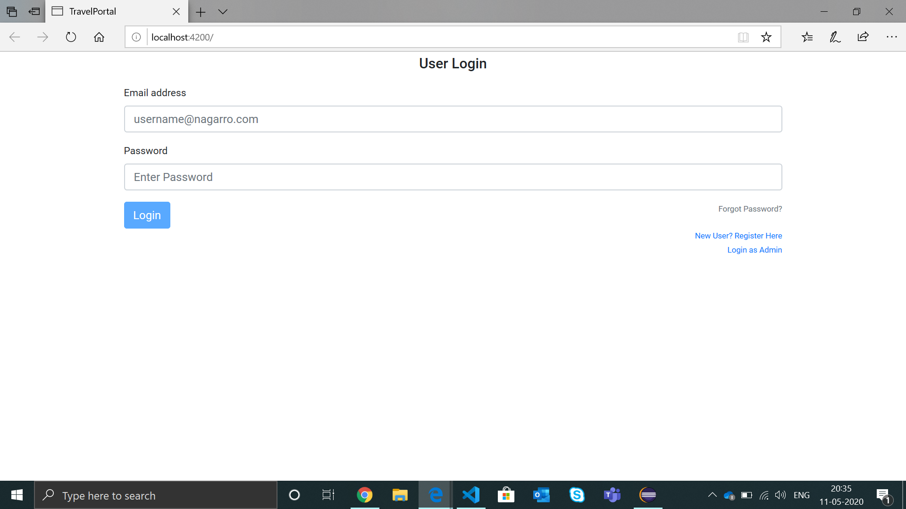
## Forgot Password
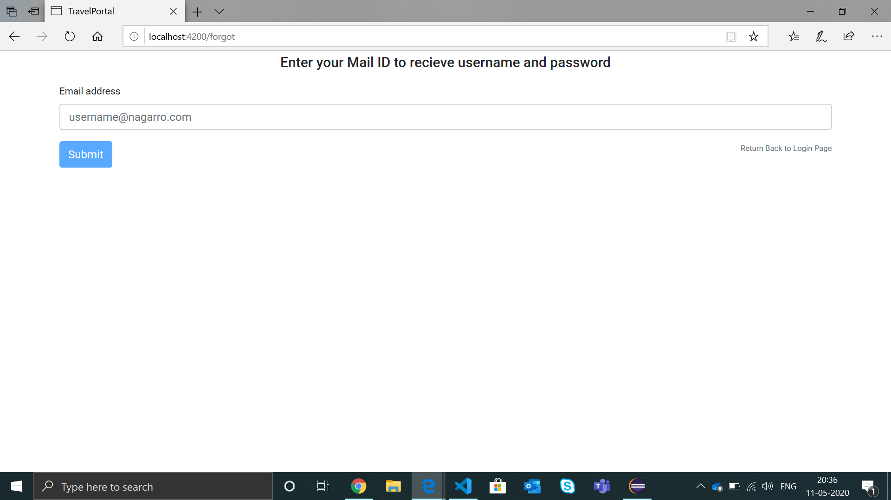
## User Registration
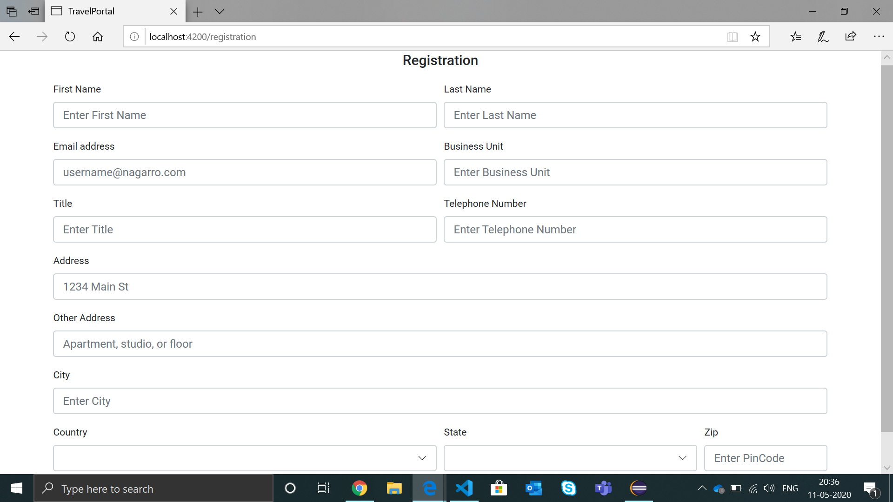
## Corona 
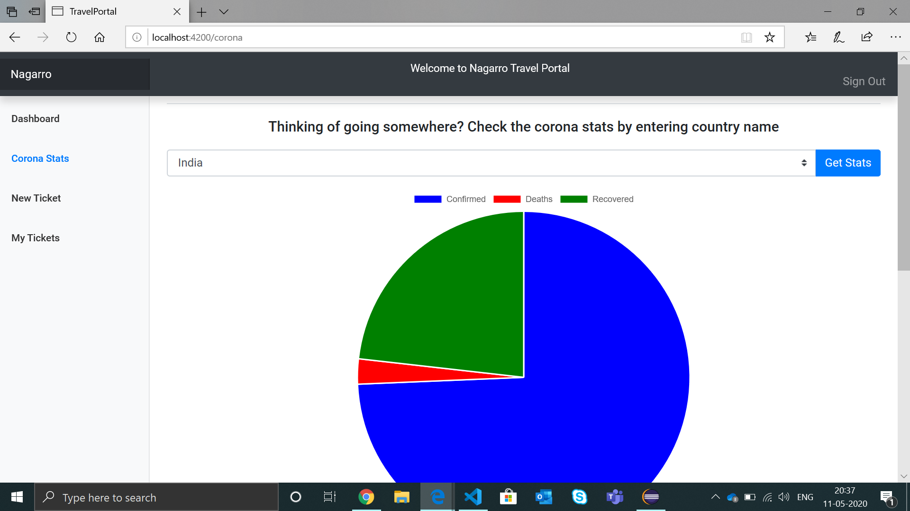
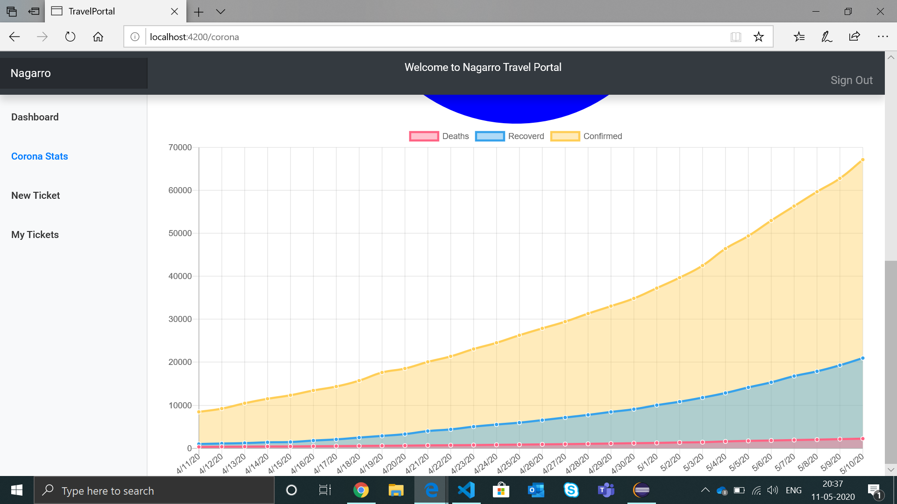
## New Ticket
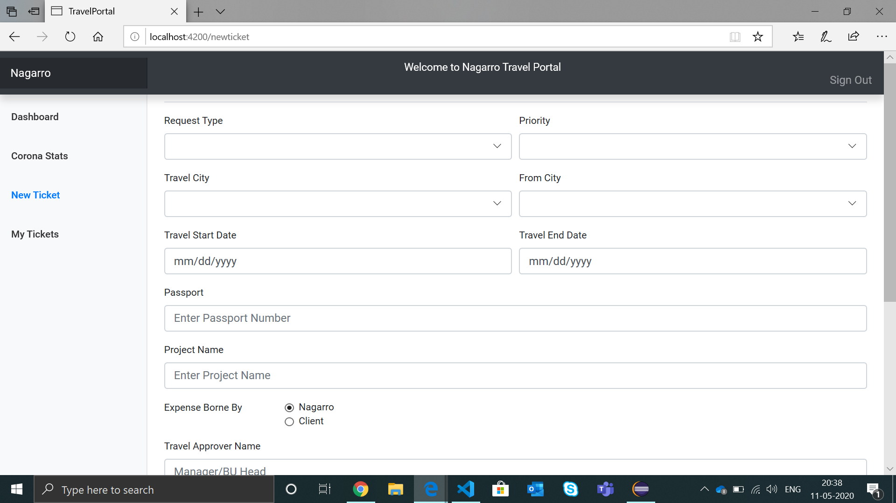
## User Tickets
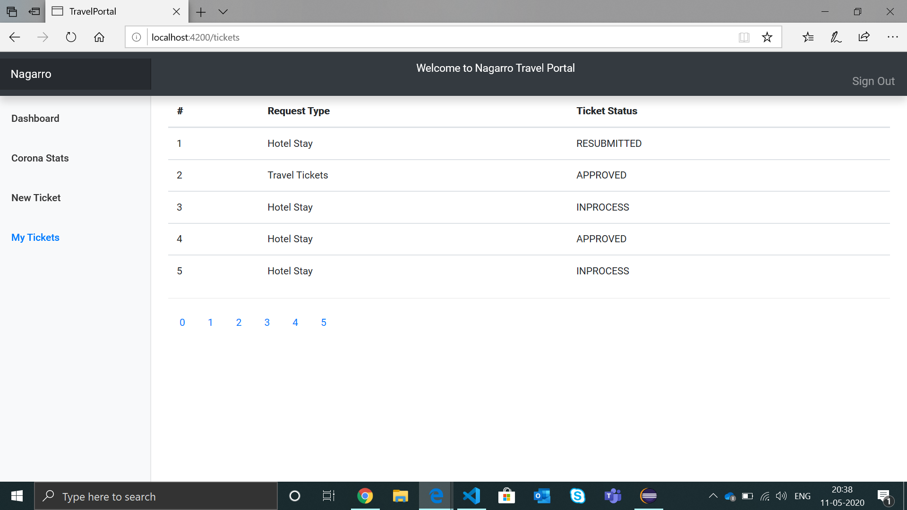
## Ticket Details
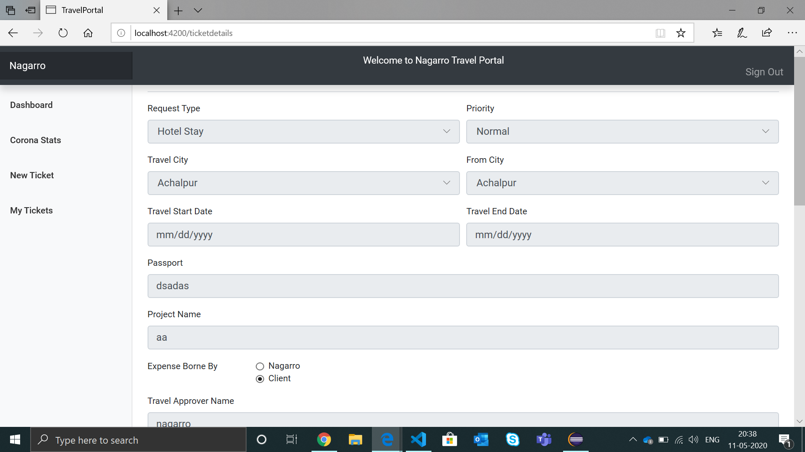
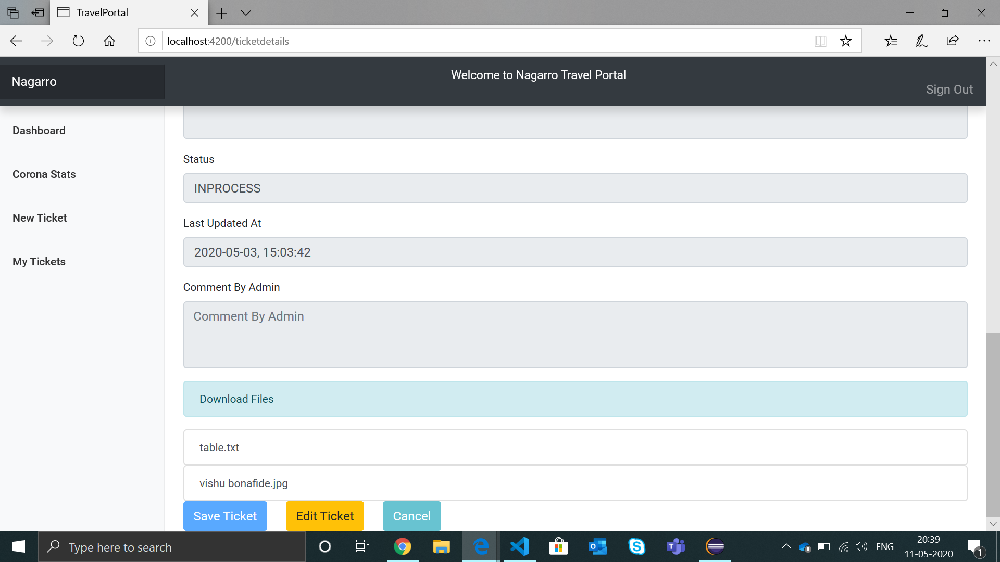
## Admin Login
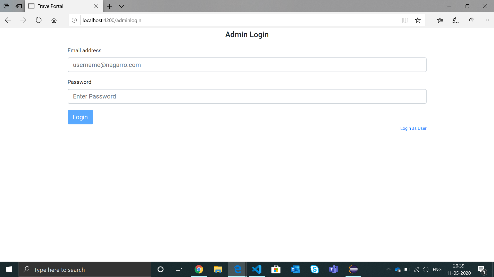
## All Tickets
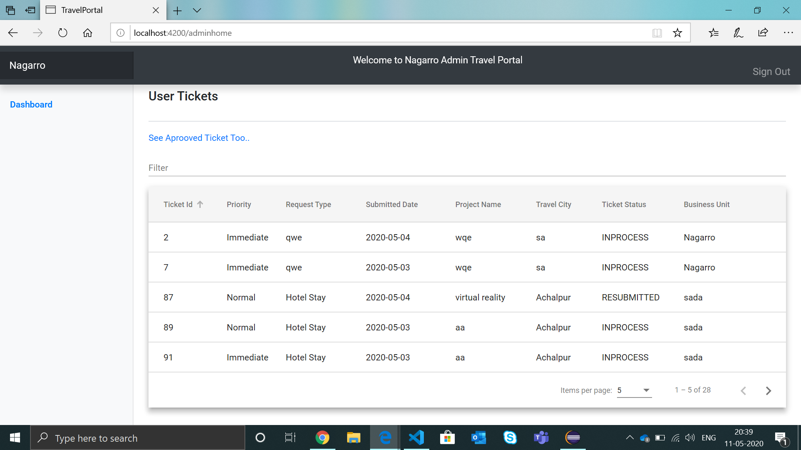
